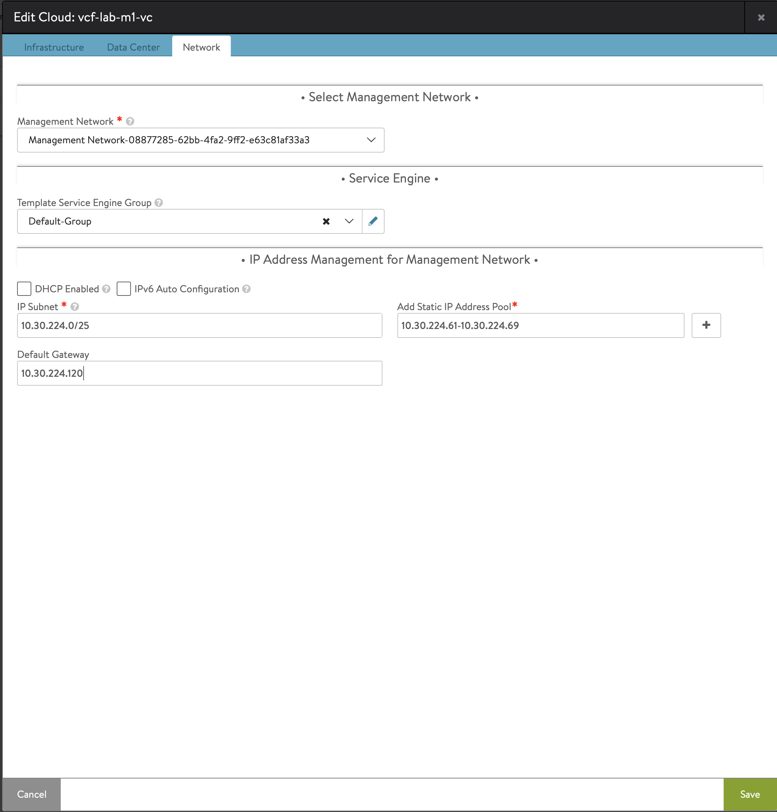

# TKG 1.4 with NSX-ALB (vSphere Network)

- [TKG 1.4 with NSX-ALB (vSphere Network)](#tkg-14-with-nsx-alb-vsphere-network)
  - [Important note](#important-note)
  - [NSX ALB deployment](#nsx-alb-deployment)
    - [Network Configuration Planning](#network-configuration-planning)
    - [Network Configuration](#network-configuration)
      - [Front-End Network](#front-end-network)
      - [Management K8s Network](#management-k8s-network)
      - [Management Network](#management-network)
    - [Controller Deployment](#controller-deployment)
    - [Initial Configuration](#initial-configuration)
    - [Form the cluster](#form-the-cluster)
    - [Patching](#patching)
    - [Cloud Configuration](#cloud-configuration)
    - [IPAM and DNS profiles](#ipam-and-dns-profiles)
    - [SE Configuration](#se-configuration)
    - [Certificate](#certificate)
    - [License](#license)
    - [Routing](#routing)
  - [Preparing an Ubuntu VM](#preparing-an-ubuntu-vm)
    - [Docker installation](#docker-installation)
    - [Kubectl et Tanzu completion](#kubectl-et-tanzu-completion)
  - [Tanzu Kubernetes Grid Deployment](#tanzu-kubernetes-grid-deployment)
    - [Prerequisites](#prerequisites)
      - [SSH Port Forwarding](#ssh-port-forwarding)
      - [SSH Key](#ssh-key)
    - [Deploy the management cluster](#deploy-the-management-cluster)
  - [Tanzu Kubernetes Grid Post Deployment](#tanzu-kubernetes-grid-post-deployment)
    - [Authenticate as admin on the Management Cluster](#authenticate-as-admin-on-the-management-cluster)
    - [Verify that all apps where deployed successfully](#verify-that-all-apps-where-deployed-successfully)
    - [Pinniped](#pinniped)
  - [Deploying Guest Clusters](#deploying-guest-clusters)
    - [Create KubeConfig files for Cluster Access](#create-kubeconfig-files-for-cluster-access)

<!-- pagebreak -->
## Important note

==**Please make sure to read the official VMware documentation as well. Especially the one related to the specific version you're going to deploy.Tanzu Kubernetes Grid is a work in progress and lots of procedures change between each release**==

## NSX ALB deployment

NSX ALB (also known as AVI Networks) is a distributed load balancer that can be used for Tanzu environments.
It's going to be used to provide VIPs for Kubernetes Control Plane as well as for any application that requires a service of type "Load Balancer". It's a replacement of both HA-Proxy and MetalLB for Tanzu with vSphere network configuration.

NSX Advanced Load Balancer includes the following components:

- **Avi Controller** manages VirtualService objects and interacts with the vCenter Server infrastructure to manage the lifecycle of the service engines (SEs). It is the portal for viewing the health of VirtualServices and SEs and the associated analytics that NSX Advanced Load Balancer provides. It is also the point of control for monitoring and maintenance operations such as backup and restore.
- **Avi Kubernetes Operator (AKO)** is a Kubernetes controller that each cluster runs on one of its nodes. Each AKO pod uses its cluster's Kubernetes API to watch for changes in the cluster's LoadBalancer and Ingress specifications, or other relevant custom resource definitions. When the AKO detects a change, it calls the Avi Controller API to make the change in the Avi resources, for example create a new load balancer VirtualService object and connect it with pods running in the cluster.
- **AKO Operator** on the management cluster manages the lifecycle and configuration of the AKO on each workload cluster, and can make runtime changes to the AKO configuration.
- **Service Engines (SE)** implement the data plane in a VM.
- **SE Groups** group Service Engines into isolated sets, for example to dedicate them to specific namespaces. This lets you control SEs collectively and set maximum SE counts for different resource types, such as CPU and Memory.

### Network Configuration Planning

As a picture is worth thousand words, here's a diagram of the network configuration as we deployed in our lab :


The following networks are configured on our vSphere / NSX environment to host Tanzu Kubernetes Grid :

|Name|Role|Type|CIDR|DHCP|
|---|---|---|---|---|
|mgmt-k8s-ingress|Front-End Network|NSX-T Overlay|10.30.230.64/27|No|
|demo-tkg-12|Management K8s|NSX-T Overlay|10.30.231.0/24|**Yes**|
|Management Network|Management VMware|VLAN|10.30.224.0/25|No|

**It's important to enable DHCP on the Management K8s network (demo-tkg-12 here). It will allow Kubernetes nodes (both master and worker) as well as AVI Service Engines to receive an IP address.**

### Network Configuration
This section describes the configuration of each segment created for TKG deployment (including NSX ALB requirements)
#### Front-End Network
The front-end network is going to host every VIPs related to TKG.
It can either be for the control plane of Kubernetes clusters, or for applications deployed on our Kubernetes clusters.

Here, we are using mgmt-k8s-ingress as this segment / port group. 


#### Management K8s Network
The Management K8s network will be used as the default network for each VMs that tanzu deploys (Kubernetes Master nodes, Kubernetes Worker Nodes, AVI Service Engines (SE)). 

As VMs on this network will be provisioned using Cluster API (CAPV), it requires a DHCP with both DNS and NTP options configured.

On our lab, we are using demo-tkg-12 NSX-T segment for this purpose.

And the DHCP configuration :


#### Management Network
The Management Network is used to provide management IP adresse to AVI controllers as well as AVI Service Engines (SE).

In our LAB environment, this network is the VLAN where we also have vCenter and ESX management adress, the portgroup is named Management Network-08877285-62bb-4fa2-9ff2-e63c81af33a3.

We need at least **6** IP addresses available on this network:
- 4 for AVI Controllers (3 controllers + 1 VIP)
- 2 for AVI SE (a pair of SEs is created for each Kubernetes cluster deployed)

### Controller Deployment

**Before deploying, create DNS records. It's mandatory to have a working cluster, especially when you want to upgrade it.**

1. Create the DNS records

2. Download AVI Controller OVAs from VMware site (TKG download page). **Make sure to download the version specified on the TKG Documentation (version 20.1.6 or 20.1.3 for TKG 1.4)**
3. Download the latest patch corresponding to the release of NSX ALB you selected
4. Deploy **3** times the same OVA to form a cluster
  
4. Power On each controller

### Initial Configuration

1. Using your browser, connect to one controller
2. Set the new admin password
  
3. Enter the passphrase, DNS resolver, DNS Search Domain, SMTP information
  
4. On the Multi-Tenant part, let the default settings

**Make sure to do this for only one controller before going to the next step**
### Form the cluster
1. Connect to the controller you previously configured via its web admin interface
2. Go to Administration > Controller > Nodes and click the Edit button
  
3. Fill the form to create the cluster
  
4. Wait 5 minutes for the process of cluster creation to start

### Patching
Once the cluster is running, we can patch it with the latest version we found on the NSX ALB download site.
1. Go to **Administration > Controller > Software**. And click **Upload From Computer**
2. Select the patch you previously downloaded
3. Once the transfert is complete, go to **Administration > Controller > System Update**
4. Select the patch and click on **Upgrade**
  
5. Leave all options by default and click on **Continue** and **Confirm**

### Cloud Configuration
The next step is to configure the Cloud. In our case, our vCenter and networks related to it.
The Management Network we are going to configure in this wizzard will be used as the Management interface for all AVI Service Engines (SE).
1. Go to **Infrastructure > Clouds**. Click on **Create > VMware vCenter/vSphere ESX**
2. Fill in the name (the name of the vCenter in our case)
3. Fill in the login informations and let all other options by default.
    
4. Select the Datacenter and leave all other options by default
5. Select the Management Network, the Default Service Engine Group and fill in the information for the management IP adresses that will be used for AVI SE.
  

==For each subnet to be configured on NSX ALB, use the real CIDR instead of the one you can see on NSX-T interface (which is the GW address instead of the CIDR)==

### IPAM and DNS profiles
In this step, we are going to create IPAM and DNS profiles. The IPAM profile will be used to provide VIPs addresses in the front-end network *(mgmt-k8s-ingress)*.
1. Go to **Templates > Profiles > IPAM/DNS profiles** and click on **Create > IPAM Profile**
2. Fill in the name and click on + Add Usable Network and select the front-end Network
  
3. Go to **Templates > Profiles > IPAM/DNS profiles** and click on **Create > DNS Profile**
4. Give a name to the template and insert the domain name you want to use
  
5. Go back to **Infrastructure > Clouds** and click on the Cloud we previously created.
6. On the Infrastructure tab, select the IPAM and DNS profiles we just created.
  
7. Go to **Infrastructure > Networks** and click on the edit button of the Front-End network (*mgmt-k8s-ingress*)
8. Click on **+Add Subnet**, and fill in the CIDR of the Front-End network (*10.30.230.64/27*)
9. The click on **+Add Static IP Address Pool**, and fill the IP range you want for your Front-End IP addresses (*10.30.230.66-10.30.230.90*)
  

### SE Configuration
AVI Service Engines will be deployed automatically, through AKO. We need to configure some settings to be sure that the SE will be deployed on the correct datastore, with a name we chose.
1. Go to **Infrastructure > Service Engine Group**, select the Cloud (at the top of the page) and edit the Default-Group
2. Click on the **Advanced** Tab
3. Select the prefix you want to use, the vSphere Cluster, and the datastore
  

### Certificate
Follow VMware's documentation for the certificate. There is no trap for this one

### License
Follow VMware's documentation for License. There is no trap for this one

### Routing
1. Go to **Infrastructure > Routing > Select Cloud : *Your Cloud*** and click **Create**
2. Insert 0.0.0.0/0 as the **Gateway subnet** and insert the gateway of the Front-End subnet as the **Next Hop**
  

<!-- pagebreak -->
## Preparing an Ubuntu VM

### Docker installation

1. First we need to update our repositories and install prerequisites
    ```
    sudo apt-get update
    sudo apt-get install \
        ca-certificates \
        curl \
        gnupg \
        lsb-release
    ```
2. Add Docker’s official GPG key:
    ```
    curl -fsSL https://download.docker.com/linux/ubuntu/gpg | sudo gpg --dearmor -o /usr/share/keyrings/docker-archive-keyring.gpg
    ```
3. Use the following command to set up the stable repository
    ```
    echo \
    "deb [arch=$(dpkg --print-architecture) signed-by=/usr/share/keyrings/docker-archive-keyring.gpg] https://download.docker.com/linux/ubuntu \
    $(lsb_release -cs) stable" | sudo tee /etc/apt/sources.list.d/docker.list > /dev/null
    ```
4. Update the apt package index, and install the latest version of Docker Engine and containerd
    ```
    sudo apt-get update
    sudo apt-get install docker-ce docker-ce-cli containerd.io
    ```
5. Add your user to the docker group
    ```
    sudo usermod -aG docker $USER
    ```
6. Log out and log back in so that your group membership is re-evaluated
7. Verify that you can run docker commands **without** sudo
    ```
    docker run hello-world
    ```


### Kubectl et Tanzu completion
To allow autocompletion of both kubectl and tanzu commands, run the following commands (be sure to have executed kubectl and tanzu commands at least once before) :
```
vmware@tkg-jump:~$ sudo apt install bash-completion
```
```
vmware@tkg-jump:~$ kubectl completion bash > ~/.kube/completion.bash.inc
  printf "
  # Kubectl shell completion
  source '$HOME/.kube/completion.bash.inc'
  " >> $HOME/.bash_profile
  source $HOME/.bash_profile
```
```
vmware@tkg-jump:~$ tanzu completion bash > ~/.kube-tkg/completion.bash.inc
  printf "
  # Tanzu shell completion
  source '$HOME/.kube-tkg/completion.bash.inc'
  " >> $HOME/.bash_profile
  source $HOME/.bash_profile
```

<!-- pagebreak -->
## Tanzu Kubernetes Grid Deployment

To deploy your first TKG management cluster, you have to have :
- NSX ALB deployed and configured
- A bootstrap VM with all the required tools installed (docker, kubectl...). We use an Ubuntu VM in our scenario

First we are going to use the UI installer, as it will help us fill the YAML file to configure the management cluster.
Before finishing and running the installation with the UI, we are going to use the command line provided to effectively launch the deployment. It will allow us to have a better verbosity on what happens on the background.

### Prerequisites

#### SSH Port Forwarding
If you run the UI installer on the VM or a Linux that doesn't have a browser, it can be helpful to redirect the port 8080 of the bootstrap VM to your machine. For this, execute the following command on **your machine**.
```
ssh -L 8080:localhost:8080 vmware@10.30.228.17
```

#### SSH Key

To create an SSH Key pair that is going to be used for tanzu, follow these steps on a Linux machine :
```
ssh-keygen -t ed25519 -C "vmware@tkg" -f ~/tkg
```
Both public and private keys are created on the home folder under the name tkg and tkg.pub

### Deploy the management cluster
1. On the bootstrap VM, execute the following command :
  ```
  tanzu management-cluster create --ui
  ```
2. Access the UI with a web browser http://localhost:8080/#/ui (either on your machine or on the bootstrap VM. See Section [SSH Port Forwarding](#ssh-port-forwarding))
3. Fill in the vCenter information and credentials, as well as the public key you created on section [SSH Key](#ssh-key)
   1. Select **Deploy TKG Management Cluster**
4. Click on the tile you want (either Development or Production), and select the Instance Type. Select NSX Advanced Load Balancer as the **Control Plane Endpoint Provider**
  
5. Insert the FQDN of the AVI Controller VIP, the username and password. Add the Root CA certificate that was used to sign the AVI controller certificate in section [Certificate](#certificate)
   1. Click on Verify
   2. Select the Cloud we created, the Default SE and the Front-End Network
    
6. Add Metadata (not mandatory)
7. Select the VM Folder where the K8s VMs will be deployed, as we as the Datastore and resource pool
   
8. Select the Network that will be used for Kubernetes VMs. **It's our Management K8s network here, the one that requires a DHCP**
   
9. Choose if you want to have LDAP or OIDC authentication here.
   1.  For LDAPS, find the instruction bellow :
       1.  Fill in the LDAPS Endpoint, BIND DN, BIND Password, **Username (UserPrincipalName)**, **User Attribute (UserPrincipalName)**, and RootCA. Other are optional
      
10. Select the OS image you want to use
11. (Optional) Register with TMC
12. Click on **Review Configuration**

**For LDAPS Identity Management, It's important to specify UserPrincipalName, even if optional. If you don't do it, the deployment of Pinniped won't work**

When you clicked on **Review Configuration**, it automatically created the YAML file that contains all the information you provided via the UI.
We are going to use it to deploy the management cluster with more verbosity.
Copy the CLI command at the bottom of the page and paste it and execute it on your bootstrap VM.

Example :
```
tanzu management-cluster create --file /home/vmware/.config/tanzu/tkg/clusterconfigs/201puronh8.yaml -v 6
```

Once you execute this command, it's going to ask you to questions:
1. Reply N for the first one (*Do you want to configure vSphere with Tanzu?*)
2. Reply Y for the second (*Would you like to deploy a non-integrated Tanzu Kubernetes Grid management cluster on vSphere 7.0? [y/N]*)

## Tanzu Kubernetes Grid Post Deployment

After the management cluster has been deployed, you need to execute some commands to be able to connect to it. Especially when you have deployed it with OIDC or LDAPS (Pinniped)

### Authenticate as admin on the Management Cluster

1. Get the admin context 
  ```
  tanzu management-cluster kubeconfig get *tkg-mgmt* --admin
  ```
2. The command line will return the command to authenticate to the management cluster as admin (creation of a Kubernetes context)
3. Execute this command, e.g.
  ```
  kubectl config use-context tkg-mgmt-vsphere-20220106172239-admin@tkg-mgmt-vsphere-20220106172239
  ```

### Verify that all apps where deployed successfully 

1. After connecting to the management cluster as admin ([Connect to the Management Cluster](#authenticate-as-admin-on-the-management-cluster))
2. Verify that all apps are reconciled successfully
  ```
  kubectl get apps -A
  ```

### Pinniped

After deploying the management cluster, we need to create a load balancer service for Pinniped.

1. Create a file pinniped-supervisor-svc-overlay.yaml with the following content:
  ```
  #@ load("@ytt:overlay", "overlay")
  #@overlay/match by=overlay.subset({"kind": "Service", "metadata": {"name": "pinniped-supervisor", "namespace": "pinniped-supervisor"}})
  ---
  #@overlay/replace
  spec:
    type: LoadBalancer
    selector:
      app: pinniped-supervisor
    ports:
      - name: https
        protocol: TCP
        port: 443
        targetPort: 8443

  #@ load("@ytt:overlay", "overlay")
  #@overlay/match by=overlay.subset({"kind": "Service", "metadata": {"name": "dexsvc", "namespace": "tanzu-system-auth"}}), missing_ok=True
  ---
  #@overlay/replace
  spec:
    type: LoadBalancer
    selector:
      app: dex
    ports:
      - name: dex
        protocol: TCP
        port: 443
        targetPort: https
  ```
2. Convert the file into a base64-encoded string:
  ```
  cat pinniped-supervisor-svc-overlay.yaml | base64 -w 0
  ```
3. Get the name of the pinniped-addon secret :
  ```
  kubectl get secrets -n tkg-system | grep pinniped-addon
  ```   
4. Patch the mgmt-pinniped-addon secret, which contains the Pinniped configuration values, with the overlay values (replace mgmt-pinniped-addon with the result of step 3 ; replace OVERLAY-BASE64 with the output of the step 2):
  ```
  kubectl patch secret *mgmt-pinniped-addon* -n tkg-system -p '{"data": {"overlays.yaml": "**OVERLAY-BASE64**"}}'
  ```
5. After a few seconds, list the pinniped-supervisor (and dexsvc if using LDAP) services to confirm that they now have type LoadBalancer:
  ```
  kubectl get services -n pinniped-supervisor
  ```
6. Delete pinniped-post-deploy-job to re-run it:
  ```
  kubectl delete jobs pinniped-post-deploy-job -n pinniped-supervisor
  ```
7. Wait for the Pinniped post-deploy job to re-create, run, and complete, which may take a few minutes. You can check status by kubectl get job:
  ```
  kubectl get job pinniped-post-deploy-job -n pinniped-supervisor
  ```

## Deploying Guest Clusters

### Create KubeConfig files for Cluster Access

