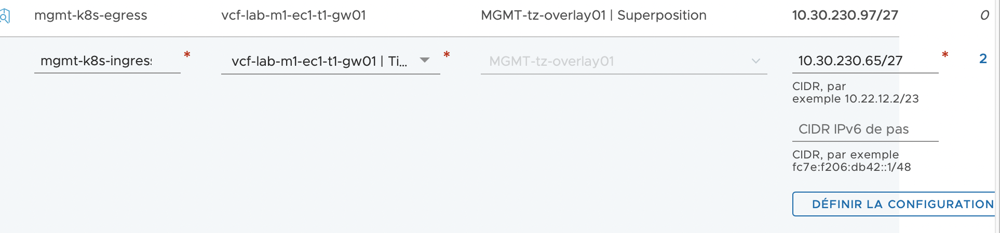

# TKG 1.4 with NSX-ALB (vSphere Network)

- [TKG 1.4 with NSX-ALB (vSphere Network)](#tkg-14-with-nsx-alb-vsphere-network)
  - [NSX ALB deployment](#nsx-alb-deployment)
    - [Network Configuration Planning](#network-configuration-planning)
    - [Network Configuration](#network-configuration)
      - [Front-End Network](#front-end-network)
      - [Management K8s Network](#management-k8s-network)
      - [Management Network](#management-network)
    - [Controller Deployment](#controller-deployment)
    - [Initial Configuration](#initial-configuration)
    - [Patching](#patching)
    - [Cloud Configuration](#cloud-configuration)
    - [SE Configuration](#se-configuration)
    - [IPAM and DNS profiles](#ipam-and-dns-profiles)
    - [Certificate](#certificate)
    - [License](#license)
    - [Routing](#routing)
  - [Preparing an Ubuntu VM](#preparing-an-ubuntu-vm)
    - [Docker installation](#docker-installation)
    - [Kubectl et Tanzu completion](#kubectl-et-tanzu-completion)
  - [Tanzu Kubernetes Grid Deployment](#tanzu-kubernetes-grid-deployment)
    - [Prerequisites](#prerequisites)
    - [SSH Keys](#ssh-keys)
    - [LDAPS](#ldaps)
    - [Tips](#tips)
  - [Tanzu Kubernetes Grid Post Deployment](#tanzu-kubernetes-grid-post-deployment)
    - [Pinniped](#pinniped)
    - [Ingress](#ingress)

<!-- pagebreak -->
## NSX ALB deployment

NSX ALB (also known as AVI Networks) is a distributed load balancer that can be used for Tanzu environments.
It's going to be used to provide VIPs for Kubernetes Control Plane as well as for any application that requires a service of type "Load Balancer". It's a replacement of both HA-Proxy and MetalLB for Tanzu with vSphere network configuration.

NSX Advanced Load Balancer includes the following components:

- **Avi Controller** manages VirtualService objects and interacts with the vCenter Server infrastructure to manage the lifecycle of the service engines (SEs). It is the portal for viewing the health of VirtualServices and SEs and the associated analytics that NSX Advanced Load Balancer provides. It is also the point of control for monitoring and maintenance operations such as backup and restore.
- **Avi Kubernetes Operator (AKO)** is a Kubernetes controller that each cluster runs on one of its nodes. Each AKO pod uses its cluster's Kubernetes API to watch for changes in the cluster's LoadBalancer and Ingress specifications, or other relevant custom resource definitions. When the AKO detects a change, it calls the Avi Controller API to make the change in the Avi resources, for example create a new load balancer VirtualService object and connect it with pods running in the cluster.
- **AKO Operator** on the management cluster manages the lifecycle and configuration of the AKO on each workload cluster, and can make runtime changes to the AKO configuration.
- **Service Engines (SE)** implement the data plane in a VM.
- **SE Groups** group Service Engines into isolated sets, for example to dedicate them to specific namespaces. This lets you control SEs collectively and set maximum SE counts for different resource types, such as CPU and Memory.

### Network Configuration Planning

As a picture is worth thousand words, here's a diagram of the network configuration as we deployed in our lab :


The following networks are configured on our vSphere / NSX environment to host Tanzu Kubernetes Grid :

|Name|Role|Type|CIDR|DHCP|
|---|---|---|---|---|
|mgmt-k8s-ingress|Front-End Network|NSX-T Overlay|10.30.230.64/27|No|
|demo-tkg-12|Management K8s|NSX-T Overlay|10.30.231.0/24|**Yes**|
|Management Network|Management VMware|VLAN|10.30.224.0/25|No|

**It's important to enable DHCP on the Management K8s network (demo-tkg-12 here). It will allow Kubernetes nodes (both master and worker) as well as AVI Service Engines to receive an IP address.**

### Network Configuration
This section describes the configuration of each segment created for TKG deployment (including NSX ALB requirements)
#### Front-End Network
The front-end network is going to host every VIPs related to TKG.
It can either be for the control plane of Kubernetes clusters, or for applications deployed on our Kubernetes clusters.

Here, we are using mgmt-k8s-ingress as this segment / port group. 


#### Management K8s Network
The Management K8s network will be used as the default network for each VMs that tanzu deploys (Kubernetes Master nodes, Kubernetes Worker Nodes, AVI Service Engines (SE)). 

As VMs on this network will be provisioned using Cluster API (CAPV), it requires a DHCP with both DNS and NTP options configured.

On our lab, we are using demo-tkg-12 NSX-T segment for this purpose.

And the DHCP configuration :


#### Management Network
The Management Network is used to provide management IP adresse to AVI controllers as well as AVI Service Engines (SE).

In our LAB environment, this network is the VLAN where we also have vCenter and ESX management adress, the portgroup is named Management Network-08877285-62bb-4fa2-9ff2-e63c81af33a3.

We need at least **6** IP addresses available on this network:
- 4 for AVI Controllers (3 controllers + 1 VIP)
- 2 for AVI SE (a pair of SEs is created for each Kubernetes cluster deployed)

### Controller Deployment

**Before deploying, create DNS records. It's mandatory to have a working cluster, especially when you want to upgrade it.**


### Initial Configuration

### Patching

### Cloud Configuration

### SE Configuration

### IPAM and DNS profiles

### Certificate

### License

### Routing

<!-- pagebreak -->
## Preparing an Ubuntu VM

### Docker installation

1. First we need to update our repositories and install prerequisites
    ```
    sudo apt-get update
    sudo apt-get install \
        ca-certificates \
        curl \
        gnupg \
        lsb-release
    ```
2. Add Docker’s official GPG key:
    ```
    curl -fsSL https://download.docker.com/linux/ubuntu/gpg | sudo gpg --dearmor -o /usr/share/keyrings/docker-archive-keyring.gpg
    ```
3. Use the following command to set up the stable repository
    ```
    echo \
    "deb [arch=$(dpkg --print-architecture) signed-by=/usr/share/keyrings/docker-archive-keyring.gpg] https://download.docker.com/linux/ubuntu \
    $(lsb_release -cs) stable" | sudo tee /etc/apt/sources.list.d/docker.list > /dev/null
    ```
4. Update the apt package index, and install the latest version of Docker Engine and containerd
    ```
    sudo apt-get update
    sudo apt-get install docker-ce docker-ce-cli containerd.io
    ```
5. Add your user to the docker group
    ```
    sudo usermod -aG docker $USER
    ```
6. Log out and log back in so that your group membership is re-evaluated
7. Verify that you can run docker commands **without** sudo
    ```
    docker run hello-world
    ```


### Kubectl et Tanzu completion
To allow autocompletion of both kubectl and tanzu commands, run the following commands (be sure to have executed kubectl and tanzu commands at least once before) :
```
vmware@tkg-jump:~$ sudo apt install bash-completion
```
```
vmware@tkg-jump:~$ kubectl completion bash > ~/.kube/completion.bash.inc
  printf "
  # Kubectl shell completion
  source '$HOME/.kube/completion.bash.inc'
  " >> $HOME/.bash_profile
  source $HOME/.bash_profile
```
```
vmware@tkg-jump:~$ tanzu completion bash > ~/.kube-tkg/completion.bash.inc
  printf "
  # Tanzu shell completion
  source '$HOME/.kube-tkg/completion.bash.inc'
  " >> $HOME/.bash_profile
  source $HOME/.bash_profile
```

<!-- pagebreak -->
## Tanzu Kubernetes Grid Deployment

### Prerequisites

### SSH Keys

### LDAPS

**Important to specify UserPrincipalName, even if optional. If you don't do it, the deployment of Pinniped won't work**

### Tips

## Tanzu Kubernetes Grid Post Deployment

### Pinniped

### Ingress